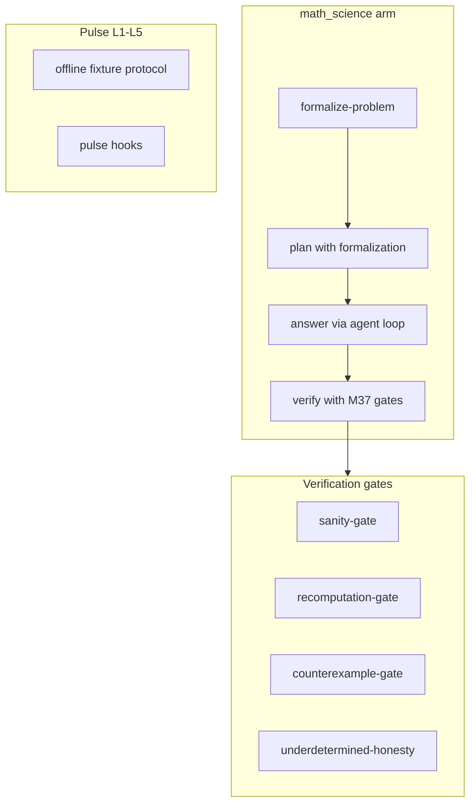

# Osirus M37 — Math / Science Intelligence V4

Branch: `build/m37-math-science-v4`  
Base: `build/m35-m44-frontier-capabilities`  
PR target: `integration`

## Mission

Extend the Math/Science arm so multi-step quantitative and scientific problems get:

1. **Problem formalization** — knowns, unknowns, constraints, assumptions and a plan before computation.
2. **Verification gates** — sanity checks, recomputation against `compute.run` evidence, and counterexample awareness for universal claims.
3. **Honest underdetermined failure** — no invented constants or definite `Result:` when the system cannot be uniquely solved.
4. **Pulse suite L1–L5** — offline capability tasks with increasing complexity.
5. **Arena regression gate** — `math_verified_rate` threshold alongside coding and research.

Constraints honoured: capability-first extension of the existing arm, no second evaluator, pulse hooks for observability.

## Architecture



## Key modules

| Path | Role |
| --- | --- |
| `src/lib/math-science/formalization.ts` | Deterministic formalization + plan steps; underdetermined detection |
| `src/lib/math-science/verification-gates.ts` | Sanity, recomputation, counterexample gates |
| `src/lib/math-science/pulse-suite.ts` | L1–L5 task definitions |
| `src/lib/math-science/pulse.ts` | Offline pulse runner + `registerMathSciencePulseHook` |
| `src/lib/arms/math-science.ts` | Arm stages, directives, integrated gates |
| `src/lib/arena/gate.ts` | `math_verified_rate` regression rule |

## Pulse levels

| Level | Focus | Example task |
| --- | --- | --- |
| L1 | Single compute, basic units | 10% discount on 50 |
| L2 | One unknown, stoichiometry | Solve 3x+7=22; moles from mass |
| L3 | Multi-step chain, kinematics | Discount+tax; projectile height |
| L4 | Net-rate reasoning, calculus | Pump+leak; definite integral |
| L5 | Underdetermined honesty, counterexamples | x+y=10; n²+n+41 primality |

## Running

```bash
# Unit tests (includes M37)
npm test

# Targeted
npx vitest run tests/math-science-v4.test.ts
npx vitest run tests/gate.test.ts

# Pulse markdown (from code)
node -e "import('./src/lib/math-science/pulse.ts').then(m => m.runMathSciencePulse(5).then(r => console.log(m.formatPulseMarkdown(r))))"
```

## Honest limits

- Formalization is **deterministic from the objective text**, not a separate model call. Rich word problems still depend on the agent loop to execute the plan.
- **No proof assistant** (Lean/Coq/Isabelle). Derivations remain derivations; unsupported claims of formal verification are still rejected.
- Pulse runs are **offline fixtures** over the production loop — not hourly live-provider pulse (M33 remains deferred).
- Counterexample search is **recorded in the answer or via compute.run**; there is no exhaustive symbolic search engine.
- Arena `math_verified_rate` is **report-only without a stored baseline**, same as other relative gate rules.

## Success criteria

- PR to `integration` with tests green.
- Math/science answers require compute evidence for determined problems.
- Underdetermined objectives fail verification when a definite result is invented.
- Pulse L1–L5 tasks verify end-to-end with gates.
